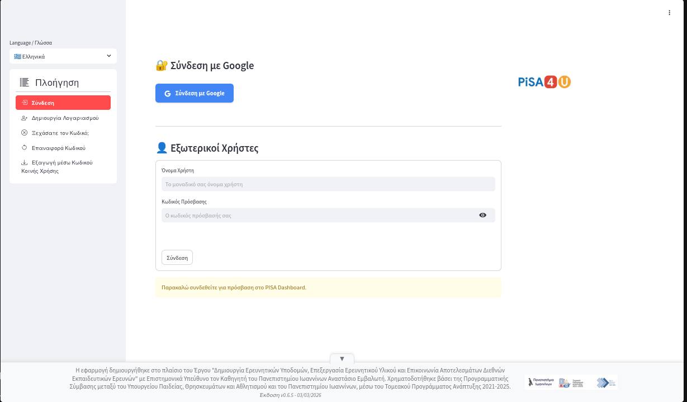

# 1. Εισαγωγή

Η εφαρμογή «Διαμεσολαβητής  δεδομένων μελετών PISA» ή Pisa Studies Data Broker (PSDB) κατασκευάστηκε με σκοπό την εύκολη πρόσβαση ερευνητών στα δεδομένα των μελετών PISA δίνοντας τη δυνατότητα συνδυασμού δεδομένων που στα πρωτογενή αρχεία των ερευνών της PISA είναι ξεχωριστά αρχεία τύπου .sav που μπορούν να επεξεργαστούν μεμονωμένα κυρίως με το λογισμικό SPSS. Μέσω μιας διαδικασίας απορρόφησης δεδομένων (data ingestion) ένας μεγάλος αριθμός `.sav` αρχείων με συνολικό μέγεθος περί τα 56GB μετατράπηκε κατάλληλα και μεταφέρθηκε σε μια Βάση Δεδομένων καταλαμβάνοντας χώρο περί τα 20GB. Η ύπαρξη όλων των δεδομένων των μελετών PISA σε μια ενιαία Βάση Δεδομένων δίνει τη δυνατότητα υποβολής ερωτημάτων που χρησιμοποιούν συνδυαστικά τους πίνακες της. Για να διευκολυνθεί η πρόσβαση στη Βάση Δεδομένων κατασκευάστηκε μια διεπαφή που ο χρήστης μπορεί να χρησιμοποιήσει μέσα από έναν απλό φυλλομετρητή (π.χ. Chrome) και με αυτό τον τρόπο να έχει πρόσβαση απευθείας σε αποτελέσματα αλλά και σε δεδομένα που μπορεί να κατεβάσει για να τα επεξεργαστεί στη συνέχεια τοπικά.

## 1.1 Δεδομένα εφαρμογής

Τα δεδομένα που χρησιμοποιήθηκαν αφορούν τις μελέτες PISA για τα έτη 2000, 2003, 2006, 2009, 2012, 2015, 2018, 2022. Ειδικότερα, τα αρχεία που απορροφήθηκαν στη Βάση Δεδομένων είναι τα εξής:

| Έτος | Ονόματα διαθέσιμων βάσεων δεδομένων |
| :--- | :--- |
| 2000 | PISA_2000_School_Data |
| 2000 | PISA_2000_Student_Data |
| 2000 | PISA_2000_Student_and_School_Data |
| 2003 | PISA_2003_School_Data |
| 2003 | PISA_2003_Student_Data |
| 2003 | PISA_2003_Student_and_School_Data |
| 2006 | PISA_2006_School_Data |
| 2006 | PISA_2006_Student_Data |
| 2006 | PISA_2006_Student_and_School_Data |
| 2009 | PISA_2009_School_Data |
| 2009 | PISA_2009_Student_Data |
| 2009 | PISA_2009_Student_and_School_Data |
| 2012 | PISA_2012_School_Data |
| 2012 | PISA_2012_Student_Data |
| 2012 | PISA_2012_Student_and_School_Data |
| 2015 | PISA_2015_School_Data |
| 2015 | PISA_2015_School_Data_w_Cyprus_Data |
| 2015 | PISA_2015_Student_Bullying_Data |
| 2015 | PISA_2015_Student_Data |
| 2015 | PISA_2015_Student_Data_el |
| 2015 | PISA_2015_Student_Data_w_Cyprus_Data |
| 2015 | PISA_2015_Student_and_School_Data |
| 2018 | PISA_2018_School_Data |
| 2018 | PISA_2018_School_Data_w_Cyprus_Data |
| 2018 | PISA_2018_Student_Data |
| 2018 | PISA_2018_Student_Data_el |
| 2018 | PISA_2018_Student_Data_w_Cyprus_Data |
| 2018 | PISA_2018_Student_and_School_Data |
| 2022 | PISA_2022_Cyprus_School_Data |
| 2022 | PISA_2022_School_Data |
| 2022 | PISA_2022_Student_Data |
| 2022 | PISA_2022_Student_Data_w_Cyprus_Data |
| 2022 | PISA_2022_Student_and_School_Data |
| 2022 | PISA_2022_Student_and_School_Data_el |

## 1.2 Πρόσβαση στην εφαρμογή

Η πρόσβαση στην εφαρμογή γίνεται με επίσκεψη στη διεύθυνση <https://data.pisa4u.gr/>. Στην αρχική οθόνη ο χρήστης εισάγει το αναγνωριστικό και τον κωδικό του προκειμένου να συνδεθεί. Επίσης δίνεται η δυνατότητα δημιουργίας νέου χρήστη για την εφαρμογή (Εικόνα 1).

