# 3. Λειτουργικότητα

## 3.1 Ευρετήριο Δεδομένων PISA

Το "Ευρετήριο Δεδομένων PISA" παρέχει ένα πλήρες κατάλογο όλων των κυμάτων (ετών), πινάκων και μεταβλητών των μελετών PISA. Μπορείτε να περιηγηθείτε και να αναζητήσετε πληροφορίες για τα διαθέσιμα δεδομένα.

Η λειτουργία χωρίζεται σε τρεις κύριες καρτέλες: "Επισκόπηση", "Ανά Κύμα" και "Αναζήτηση".

### Καρτέλα "Επισκόπηση"

Η καρτέλα "Επισκόπηση" παρέχει μια γενική εικόνα των δεδομένων PISA:

1.  **Σύνοψη Δεδομένων.** Εμφανίζει συνολικούς αριθμούς για τα κύματα, τους πίνακες, τις γραμμές και τις στήλες που περιέχονται στη βάση δεδομένων.
    
    

2.  **Ανάλυση ανά Κύμα.** Παρουσιάζει έναν πίνακα με αναλυτικά στατιστικά για κάθε κύμα PISA (όπως πλήθος πινάκων, γραμμών και στηλών, καθώς και κατανομή τύπων πινάκων).
    
    

3.  **Οπτικοποιήσεις.** Εμφανίζει γραφήματα (π.χ. ραβδογράμματα) που απεικονίζουν το πλήθος των πινάκων και των γραμμών ανά κύμα PISA.
    
    

### Καρτέλα "Ανά Κύμα"

Η καρτέλα "Ανά Κύμα" επιτρέπει την εξερεύνηση των δεδομένων ανά συγκεκριμένο κύμα PISA:

1.  **Επιλογή Κύματος.** Επιλέξτε ένα κύμα PISA (π.χ. `PISA 2018`) από την αναπτυσσόμενη λίστα.
    
    

2.  **Στατιστικά Κύματος.** Μετά την επιλογή κύματος, εμφανίζονται συνοπτικά στατιστικά για το συγκεκριμένο κύμα (π.χ. σύνολο πινάκων, γραμμών, στηλών και τύπων πινάκων).
    
    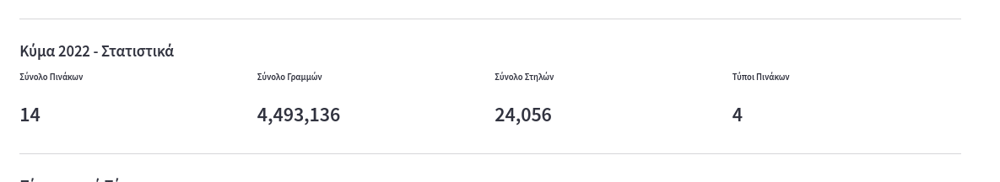

3.  **Πίνακες ανά Τύπο.** Οι πίνακες του επιλεγμένου κύματος ομαδοποιούνται ανά τύπο (π.χ. Μαθητές, Σχολεία, Γνωστικά). Για κάθε τύπο, μπορείτε να επεκτείνετε την ενότητα για να δείτε μια λίστα πινάκων.
    
    

4.  **Λεπτομέρειες Πίνακα και Ετικέτες.** Για κάθε πίνακα, εμφανίζονται βασικές πληροφορίες. Μπορείτε να πατήσετε "Εμφάνιση Ετικετών" για να δείτε έναν πίνακα με τις μεταβλητές του πίνακα και τις περιγραφές τους. Εάν υπάρχουν πολλές ετικέτες, μπορείτε να τις αναζητήσετε.
    
    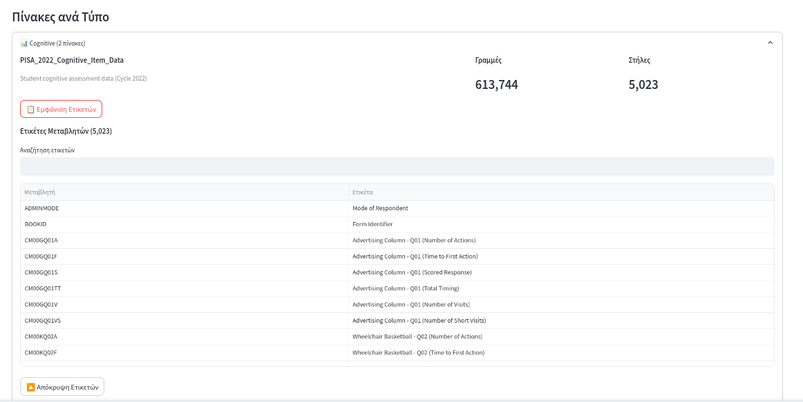

### Καρτέλα "Αναζήτηση"

Η καρτέλα "Αναζήτηση" επιτρέπει την αναζήτηση πινάκων με βάση έναν όρο αναζήτησης:

1.  **Εισαγωγή Όρου Αναζήτησης.** Πληκτρολογήστε έναν όρο αναζήτησης (π.χ. "Μαθητές", "2018", "Γνωστικά") στο πεδίο αναζήτησης.
    
    

2.  **Αποτελέσματα Αναζήτησης.** Εάν βρεθούν αποτελέσματα, αυτά εμφανίζονται σε αναπτυσσόμενες ενότητες. Για κάθε πίνακα που ταιριάζει με τον όρο αναζήτησης, μπορείτε να δείτε τον τύπο του, την περιγραφή του, το πλήθος των γραμμών και των στηλών του, καθώς και να εμφανίσετε τις ετικέτες των μεταβλητών του.
    
    


## 3.2 Λήψη Δεδομένων PISA μέσω Κωδικού Κοινής Χρήσης

Η λειτουργία "Λήψη Δεδομένων PISA μέσω Κωδικού Κοινής Χρήσης" επιτρέπει στους χρήστες να ανακτήσουν ένα αρχείο εξαγωγής δεδομένων χρησιμοποιώντας έναν μοναδικό κωδικό κοινής χρήσης που έχει δημιουργηθεί προηγουμένως (π.χ. από τον Οδηγό Εξαγωγής Δεδομένων).

### Πώς Λειτουργούν οι Κωδικοί Κοινής Χρήσης:
*   **Προσωρινοί και Ασφαλείς**: Κάθε κωδικός κοινής χρήσης συνδέεται μοναδικά με ένα συγκεκριμένο αρχείο εξαγωγής.
*   **Αποθηκεύονται μέχρι την Κυριακή**: Όλες οι εξαγωγές διατηρούνται μέχρι την επόμενη Κυριακή στις 00:00 (μεσάνυχτα) ώρα Ελλάδας (EET/EEST). Μετά από αυτό, διαγράφονται αυτόματα.
*   **Εύκολα Κοινοποιήσιμοι**: Μπορείτε να κοινοποιήσετε τον κωδικό σας σε άλλους για να τους επιτρέψετε να κατεβάσουν την ίδια εξαγωγή.
*   **Ιδανικοί για Μεγάλες Εξαγωγές**: Συνιστάται για μεγαλύτερα σύνολα δεδομένων ή όταν χρειάζεστε να ανακτήσετε το αρχείο αργότερα.
*   **Σημείωση**: Οποιοσδήποτε έχει τον κωδικό κοινής χρήσης μπορεί να έχει πρόσβαση στην σχετική εξαγωγή.

### Βήματα Λήψης:

1.  **Εισαγωγή Κωδικού Κοινής Χρήσης.** Στο πεδίο "Εισάγετε Κωδικό Κοινής Χρήσης", πληκτρολογήστε τον κωδικό που έχετε λάβει (π.χ. `73adb3505065-cb9a77f6a61f`).
    
    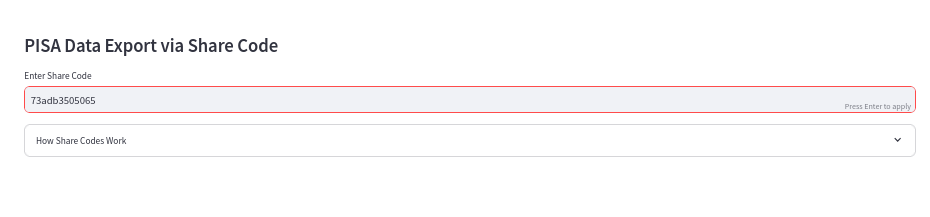

2.  **Ανάκτηση και Λήψη Αρχείου.** Μόλις εισαχθεί ο κωδικός, το σύστημα θα επιχειρήσει να ανακτήσει τα μεταδεδομένα του αρχείου. Εάν η ανάκτηση είναι επιτυχής, θα εμφανιστεί ένα κουμπί "Λήψη Αρχείου" με το όνομα του αρχείου. Πατήστε αυτό το κουμπί για να κατεβάσετε το αρχείο.
    
    


## 3.3 Οδηγός Εξαγωγής Δεδομένων PISA

Η λειτουργία "Οδηγός Εξαγωγής Δεδομένων PISA" επιτρέπει στους χρήστες να επιλέγουν και να εξάγουν συγκεκριμένα σύνολα δεδομένων από την ενιαία Βάση Δεδομένων PISA. Ο οδηγός ακολουθεί μια σειρά βημάτων για τη διαμόρφωση της εξαγωγής σας.

### Συμβουλές για Εξαγωγή Δεδομένων
Πριν ξεκινήσετε, λάβετε υπόψη τις ακόλουθες συμβουλές για βέλτιστη απόδοση:
*   **Για μικρά σύνολα δεδομένων (λιγότερες από 50 στήλες)**: Χρησιμοποιήστε την επιλογή "Απευθείας Λήψη CSV".
*   **Για μεγάλα σύνολα δεδομένων (περισσότερες από 50 στήλες)**: Συνιστάται η χρήση της επιλογής "Δημιουργία Κωδικού Κοινής Χρήσης" για αξιόπιστη εξαγωγή.
*   **Εάν αντιμετωπίσετε σφάλματα**: Δοκιμάστε να μειώσετε τον αριθμό των στηλών ή να χρησιμοποιήσετε την επιλογή κωδικού κοινής χρήσης.
*   **Φιλτράρισμα χώρας**: Μπορείτε να φιλτράρετε προαιρετικά τα δεδομένα ανά συγκεκριμένες χώρες για να μειώσετε το μέγεθος της εξαγωγής.
*   Οι μεγάλες εξαγωγές μπορεί να διαρκέσουν αρκετά λεπτά. Η επιλογή κωδικού κοινής χρήσης είναι πιο αξιόπιστη για μεγάλα σύνολα δεδομένων.

### Βήματα Εξαγωγής Δεδομένων

Η διαδικασία εξαγωγής δεδομένων γίνεται επιλέγοντας με τη σειρά:

1.  **Επιλογή Μεθόδου Ρύθμισης.** Αρχικά, επιλέξτε πώς θέλετε να ρυθμίσετε την εξαγωγή σας:
    *   **Μεταφόρτωση Αρχείου Διαμόρφωσης**: Εάν διαθέτετε ένα έτοιμο αρχείο διαμόρφωσης JSON, μπορείτε να το ανεβάσετε. Το σύστημα θα φορτώσει τις ρυθμίσεις από αυτό.
    *   **Χειροκίνητη Επιλογή**: Εάν δεν έχετε αρχείο διαμόρφωσης, μπορείτε να προχωρήσετε με την χειροκίνητη επιλογή των παραμέτρων βήμα-βήμα.
    
    

    *Μορφή αρχείου διαμόρφωσης:*
    Εάν επιλέξετε "Μεταφόρτωση Αρχείου Διαμόρφωσης", το αρχείο σας πρέπει να έχει την ακόλουθη μορφή JSON:
    ```json
    {
      "cycle": "PISA_2012",
      "table": "PISA_2012_Cognitive_Item_Data",
      "columns": ["CNT", "PM155Q01", "PM155Q04T", "PM192Q01T"],
      "countries": ["USA", "GRC", "FRA"],
      "export_option": "direct"
    }
    ```
    *Περιγραφές πεδίων:*
    *   `cycle` (string): Το όνομα του κύκλου PISA (π.χ. `PISA_2012`).
    *   `table` (string): Το πλήρες όνομα του πίνακα.
    *   `columns` (array): Λίστα ονομάτων στηλών για εξαγωγή.
    *   `countries` (array): Προαιρετική λίστα κωδικών χωρών (π.χ. `["USA", "GRC"]`).
    *   `export_option` (string): Είτε `"direct"` (για απευθείας λήψη) είτε `"share"` (για δημιουργία κωδικού κονητη επιλογή.

2.  **Επιλογή Κύκλου.** Επιλέξτε τον κύκλο PISA (π.`, `PISA_2022`) από την αναπτυσσόμενη λίστα.
    
    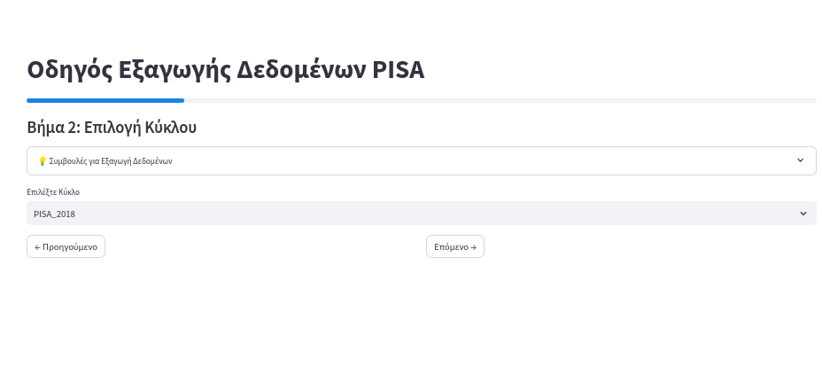

3.  **Επιλογή Πίνακα.** Επιλέξτε τον συγκεκριμένο πίνακα από τους διαθέσιμους για τον επιλεγμένο κύκλο.
    
    

4.  **Επιλογή Στηλών.** Σε αυτό το βήμα, εμφανίζεται ένας πίνακας με όλες τις στήλες του επιλεγμένου πίνακα. Μπορείτε να επιλέξετε τις στήλες που θέτετε να συμπεριλάβετε στην εξαγωγή, χρησιμοποιώντας τα πλαίσια ελέγχου. Υπάρχουν επίσης επιλογές για "Επιλογή Όλων των Στηλών" ή "Αποεπιλογή Όλων των Στηλών".
    
    

5.  **Επιλογές Φίλτρου.** Εδώ μπορείτε προαιρετικά να φιλτράρετε τα δεδομένα ανά χώρα. Επιλέξτε μία ή περισσότερες χώρες από την αναπτυσσόμενη λίστα. Εάν δεν επιλέξετε καμία χώρα, η εξαγωγή θα περιλαμβάνει δεδομένα από όλες τις χώρες.
    
    

6.  **Εξαγωγή Δεδομένων.** Στο τελικό βήμα, επιλέξτε τον τρόπο εξαγωγής των δεδομένων:
    *   **Απευθείας Λήψη CSV**: Κατεβάζει το αρχείο CSV απευθείας στον υπολογιστή σας. Συνιστάται για μικρά σύνολα δεδομένων.
    *   **Δημιουργία Κωδικού Κοινής Χρήσης**: Δημιουργίζει έναν μοναδικό κωδικό που μπορείτε να χρησιμοποιήσετε για να κατεβάσετε το αρχείο αργότερα ή να το μοιραστείτε με άλλους. Συνιστάται για μεγάλα σύνολα δεδομένων.
    
    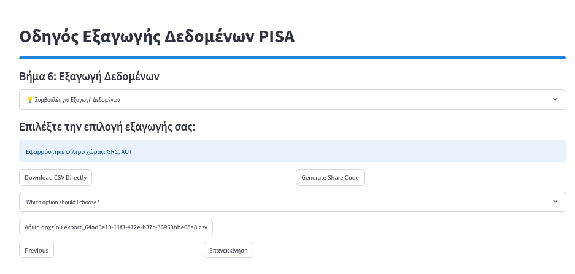

    *Εάν επιλέξετε "Δημιουργία Κωδικού Κοινής Χρήσης", ο κωδικός θα εμφανιστεί στην οθόνη και μπορείτε να τον χρησιμοποιήσετε στην ειδική σελίδα λήψης αρχείων.*
    
    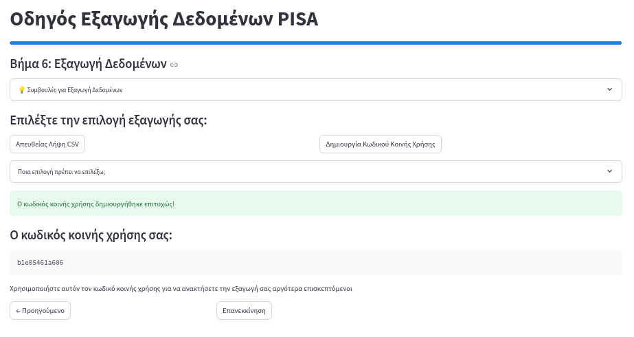


## 3.4 Τάσεις Μεταβλητών Ανά Κύκλο

Η λειτουργία "Τάσεις Μεταβλητών ανά Κύκλο" επιτρέπει στους χρήστες να εξερευνήσουν την εξέλιξη συγκεκριμένων μεταβλητών σε διάφορους κύκλους των μελετών PISA, εμφανίζοντας τα αποτελέσματα σε ένα διαδραστικό γράφημα. Η ανάλυση γίνεται επιλέγοντας με τη σειρά:

1.  **Επιλογή Μεθόδου Ρύθμισης.** Αρχικά, επιλέξτε πώς θέτετε να ρυθμίσετε την ανάλυσή σας:
    *   **Μεταφόρτωση Αρχείου Διαμόρφωσης**: Εάν διαθέτετε ένα έτοιμο αρχείο διαμόρφωσης JSON, μπορείτε να το ανεβάσετε. Το σύστημα θα φορτώσει τις ρυθμίσεις από αυτό.
    *   **Χειροκίνητη Επιλογή**: Εάν δεν έχετε αρχείο διαμόρφωσης, μπορείτε να προχωρήσετε με την χειροκίνητη επιλογή των παραμέτρων βήμα-βήμα.
    
    

    *Μορφή αρχείου διαμόρφωσης:*
    Εάν επιλέψετε "Μεταφόρτωση Αρχείου Διαμόρφωσης", το αρχείο σας πρέπει να έχει την ακόλουθη μορφή JSON:
    ```json
    {
      "category": "Student Cognitive",
      "cycles": ["PISA_2006", "PISA_2009"],
      "tables": ["PISA_2006_Cognitive_Item_Data", "PISA_2009_Cognitive_Item_Data"],
      "variables": ["M155Q01", "M155Q04T", "M192Q01T"],
      "countries": ["GRC", "USA", "AUS"],
      "aggregation": "COUNT"
    }
    ```
    *Περιγραφές πεδίων:*
    *   `category` (string): Κατηγορία δεδομένων (π.χ. `"Student Cognitive"`).
    *   `cycles` (array): Λίστα κύκλων PISA.
    *   `tables` (array): Λίστα ονομάτων πινάκων.
    *   `variables` (array): Λίστα ονομάτων μεταβλητών.
    *   `countries` (array): Προαιρετική λίστα κωδικών χωρών.
    *   `aggregation` (string): `AVG`, `COUNT`, `MIN`, `MAX`, `SUM`, `Percentage`. Προαιρετικό, προεπιλογή `AVG`.

2.  **Επιλογή Κατηγορίας & Κύκλων.** Επιλέξτε την κατηγορία δεδομένων (π.χ. "Ερωτηματολόγιο Μαθητή") και τους κύκλους PISA (π.χ. `PISA_2006`, `PISA_2009`) από τις αντίστοιχες λίστες.
    
    

3.  **Επιλογή Πινάκων.** Επιλέξτε τους πίνακες που θέλετε να χρησιμοποιήσετε για την ανάλυση από τη λίστα των διαθέσιμων πινάκων, οι οποίοι έχουν φιλτραριστεί με βάση την κατηγορία και τους κύκλους που επιλέξατε.
    
    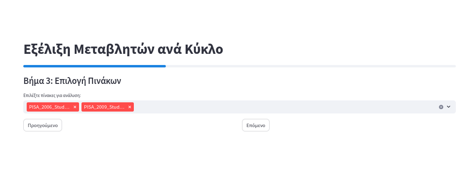

4.  **Επιλογή Μεταβλητών.** Εμφανίζεται ένας πίνακας με όλες τις διαθέσιμες στήλες (μεταβλητές) από τους επιλεγμένους πίνακες. Για κάθε μεταβλητή, βλέπετε το όνομά της, την περιγραφή της και τους πίνακες στους οποίους περιέχεται. Επιλέξτε τις μεταβλητές που επιθυμείτε χρησιμοποιώντας τα πλαίσια ελέγχου. Μπορείτε να χρησιμοποιήσετε τα κουμπιά "Επιλογή Όλων" και "Αποεπιλογή Όλων", καθώς και να φιλτράρετε τις μεταβλητές με κείμενο.
    
    

5.  **Φιλτράρισμα ανά Χώρα.** Προαιρετικά, μπορείτε να επιλέξετε συγκεκριμένες χώρες για να περιορίσετε την ανάλυση. Εάν δεν επιλεγεί καμία χώρα, η ανάλυση θα γίνει για όλες τις διαθέσιμες χώρες.
    
    

6.  **Επιλογή Συνάρτησης Συγκέντρωσης.** Επιλέξτε τη συνάρτηση συγκέντρωσης (π.χ. `AVG`, `COUNT`, `Percentage`) που θα εφαρμοστεί στις επιλεγμένες μεταβλητές:
    *   **AVG, SUM, MIN, MAX**: Λειτουργούν με αριθμητικές στήλες. Το σύστημα θα παραλείψει αυτόματα τις μη αριθμητικές και θα εμφανίσει προειδοποιήσεις.
    *   **COUNT**: Μετράει τον αριθμό των μη-κενών τιμών σε κάθε στήλη. Λειτουργεί με όλους τους τύπους δεδομένων.
    *   **Percentage**: Δείχνει την κατανομή των τιμών 1 και 2 ως ποσοστά (ιδανικό για δυαδικές μεταβλητές).
    
    

7.  **Προβολή Γραφήματος.** Τα αποτελέσματα της ανάλυσης εμφανίζονται σε ένα διαδραστικό γράφημα.
    *   Εάν επιλέξατε `Percentage`, θα δείτε ένα ιστόγραμμα με στοίβαξη που απεικονίζει την ποσοστιαία κατανομή.
    *   Για άλλες συναθροίσεις, θα εμφανιστεί ένα γράφημα γραμμής που δείχνει την εξέλιξη της μεταβλητής.
    Τα γραφήματα περιλαμβάνουν εργαλεία για μεγέθυνση, μετατόπιση, προβολή δεδομένων και αποθήκευση εικόνας.
    
    
    
    

## 3.5 Σύγκριση Δεδομένων Μαθητών-Σχολείων

Η λειτουργία "Σύγκριση Δεδομένων Μαθητών-Σχολείων" επιτρέπει στους χρήστες να συγκρίνουν δεδομένα από πίνακες μαθητών και πίνακες σχολείων. Αυτό επιτυγχάνεται με τη συνάθροιση δεδομένων μαθητών και τον συνδυασμό τους με αντίστοιχα δεδομένα από σχολεία, χρησιμοποιώντας ένα κοινό πεδίο (π.χ. αναγνωριστικό σχολείου). Η διαδικασία γίνεται επιλέγοντας με τη σειρά:

1.  **Επιλογή Μεθόδου Ρύθμισης.** Αρχικά, επιλέξτε πώς θέλετε να ρυθμίσετε τη σύγκρισή σας:
    *   **Μεταφόρτωση Αρχείου Διαμόρφωσης**: Αν διαθέτετε ένα έτοιμο αρχείο διαμόρφωσης JSON, μπορείτε να το ανεβάσετε για να φορτώσετε τις ρυθμίσεις.
    *   **Χειροκίνητη Επιλογή**: Αν δεν έχετε αρχείο διαμόρφωσης, προχωρήστε με την χειροκίνητη επιλογή των παραμέτρων βήμα-βήμα.
    
    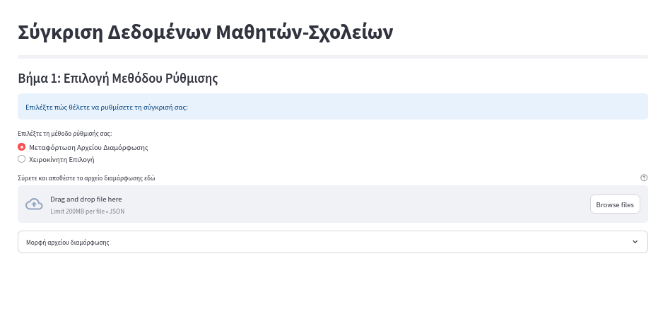

    *Μορφή αρχείου διαμόρφωσης:*
    Εάν επιλέξετε "Μεταφόρτωση Αρχείου Διαμόρφωσης", το αρχείο σας πρέπει να έχει την ακόλουθη μορφή JSON:
    ```json
    {
      "student_table": "PISA_2012_Student_Data",
      "school_table": "PISA_2012_School_Data",
      "common_column": "CNTSCHID",
      "student_column": "PV1MATH",
      "school_column": "SC01Q01",
      "agg_function": "AVG",
      "countries": ["USA", "GRC", "FRA"],
      "school_ids": []
    }
    ```
    *Περιγραφές πεδίων:*
    *   `student_table` (string): Όνομα πίνακα μαθητών.
    *   `school_table` (string): Όνομα πίνακα σχολείων.
    *   `common_column` (string): Κοινή στήλη για τη σύνδεση των πινάκων (π.χ. `CNTSCHID`).
    *   `student_column` (string): Στήλη μαθητών για συνάθροιση.
    *   `school_column` (string): Στήλη σχολείων για σύγκριση.
    *   `agg_function` (string): Συνάρτηση συνάθροισης (`AVG`, `SUM`, `COUNT`, `MIN`, `MAX`).
    *   `countries` (array): Προαιρετική λίστα κωδικών χωρών.
    *   `school_ids` (array): Προαιρετική λίστα αναγνωριστικών σχολείων.

2.  **Επιλογή Πινάκων.** Επιλέξτε τον πίνακα μαθητών (π.χ. `PISA_2018_Student_Data`) και τον πίνακα σχολείων (π.χ. `PISA_2018_School_Data`) από τις αναπτυσσόμενες λίστες.
    
    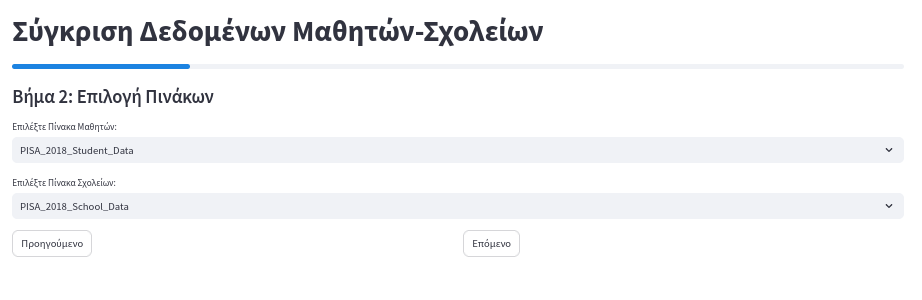

3.  **Επιλογή Στηλών & Συνάρτησης Συγκέντρωσης.** Επιλέξτε το κοινό πεδίο (π.χ. `CNTSCHID`) που συνδέει τους δύο πίνακες, τη μεταβλητή μαθητών για συνάθροιση, τη μεταβλητή σχολείων για σύγκριση και τη συνάρτηση συγκέντρωσης (π.χ. `AVG`, `SUM`, `COUNT`) που θα εφαρμοστεί στα δεδομένα των μαθητών.
    
    

4.  **Εφαρμογή Φίλτρων.** Προαιρετικά, εφαρμόστε φίλτρα στα δεδομένα. Μπορείτε να φιλτράρετε ανά Χώρα (CNT) και ανά Αναγνωριστικό Σχολείου (CNTSCHID). Αφού ορίσετε τα φίλτρα, πατήστε "Εκτέλεση Ερωτήματος".
    
    

5.  **Προβολή Αποτελεσμάτων.** Τα αποτελέσματα της σύγκρισης θα εμφανιστούν σε έναν πίνακα. Μπορείτε να επιλέξετε ποιες στήλες θέλετε να προβάλετε χρησιμοποιώντας τα αντίστοιχα πλαίσια ελέγχου.
    
    

6.  **Λήψη Δεδομένων.** Στο τελευταίο βήμα, εμφανίζεται μια προεπισκόπηση των δεδομένων. Επιλέξτε τη μορφή αρχείου (CSV, Excel, JSON) στην οποία θέτετε να γίνει η λήψη των αποτελεσμάτων. Παρέχονται επίσης κουμπιά για να επιστρέψετε σε προηγούμενο βήμα ή να ξεκινήσετε τη διαδικασία από την αρχή.
    
    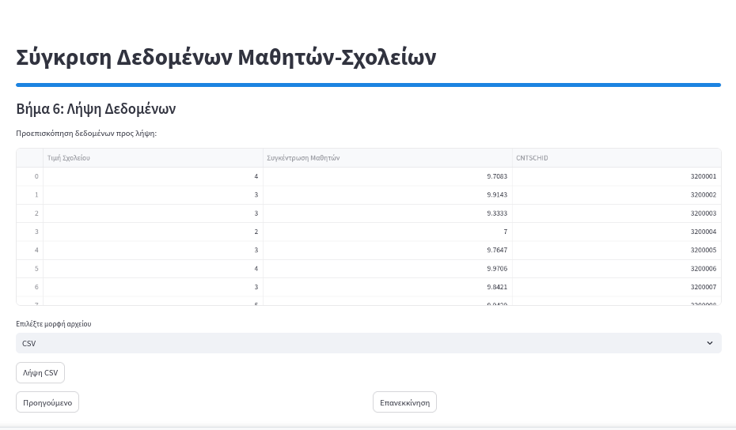

## 3.6 Αναζήτηση & Ανακάλυψη Στηλών

Η λειτουργία "Αναζήτηση & Ανακάλυψη Στηλών" επιτρέπει στους χρήστες να βρίσκουν στήλες σε όλους τους πίνακες της βάσης δεδομένων χρησιμοποιώντας σύνθετα μοτίμα αναζήτησης (regex - κανονικές εκφράσεις). Τα επιλεγμένα ζεύγη πίνακας:στήλη μπορούν να συλλεχθούν σε ένα "καλάθι" και να εξαχθούν σε ένα ενιαίο αρχείο CSV.

### Ροή Εργασίας:
1.  **Αναζητήστε** στήλες χρησιμοποιώντας μοτίβα regex.
2.  **Επιλέξτε** τα ζεύγη πίνακας:στήλη που θέτετε από τα αποτελέσματα.
3.  **Προσθήκη στο Καλάθι** για να αποθηκεύσετε τις επιλογές σας.
4.  **Επαναλάβετε** τις αναζητήσεις για να προσθέσετε περισσότερες στήλες.
5.  **Εξαγωγή σε CSV** όταν είστε έτοιμοι.

### Βήματα Αναζήτησης & Εξαγωγής:

1.  **Εισαγωγή μοτίβου αναζήτησης.** Στο πεδίο "Εισάγετε ένα μοτίβο regex για φιλτράρισμα στηλών:", πληκτρολογήστε το μοτίβο regex που θέτετε να χρησιμοποιήσετε (π.χ. `SC*`, `*AGE*`, `CM03*`).
    
    
    *Χαρακτηριστικά αναζήτησης:*
    *   **Πραγματικού χρόνου streaming**: Δείτε τα αποτελέσματα καθώς βρίσκονται.
    *   **Παρακολούθηση προόδου**: Παρακολουθήστε την πρόοδο αναζήτησης στους πίνακες.
    *   **Αντιστοίχιση μοτίβων**: Χρησιμοποιήστε `*` ως wildcard για ευέλικτες αναζητήσεις.

2.  **Προβολή και επιλογή αποτελεσμάτων.** Τα αποτελέσματα εμφανίζονται καθώς βρίσκονται, με το όνομα του πίνακα, το όνομα της στήλης και την ετικέτα της. Επιλέξτε τα ζεύγη πίνακας:στήλη που σας ενδιαφέρουν χρησιμοποιώντας τα πλαίσια ελέγχου.
    
    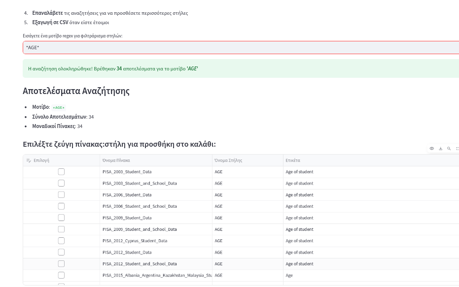

3.  **Προσθήκη στο Καλάθι.** Πατήστε το κουμπί **"➕ Προσθήκη Επιλεγμένων στο Καλάθι"** για να προσθέσετε τις επιλεγμένες στήλες στο καλάθι σας. Μπορείτε να εκτελέσετε πολλαπλές αναζητήσεις και να προσθέτετε στήλες στο ίδιο καλάθι.
    
    

4.  **Διαχείριση Καλαθιού.** Στην ενότητα "Επιλεγμένο Καλάθι", μπορείτε να δείτε όλα τα στοιχεία που έχετε συλλέξει.
    *   **Προβολή ανά Πίνακα**: Δείτε τις στήλες ομαδοποιημένες ανά πίνακα.
    *   **Διαχείριση**: Μπορείτε να αφαιρέσετε μεμονωμένα στοιχεία χρησιμοποιώντας τα πλαίσια ελέγχου και το κουμπί **"🗑️ Αφαίρεση Επιλεγμένων"**, ή να εκκαθαρίσετε ολόκληρο το καλάθι με το κουμπί **"🧹 Εκκαθάριση Όλων"**.
    
    

5.  **Εξαγωγή Δεδομένων.** Όταν είστε έτοιμοι να εξάγετε τα δεδομένα από τις στήλες που έχετε συλλέξει στο καλάθι σας, πατήστε το κουμπί **"Εξαγωγή σε CSV"**. Τα δεδομένα θα ανακτηθούν από τους αντίστοιχους πίνακες και θα γίνει λήψη ως ενιαίο αρχείο CSV.
    
    

## 3.7 Οπτικοποίηση Δεδομένων Χωρών

Η λειτουργία "Οπτικοποίηση Δεδομένων Χωρών PISA" επιτρέπει στους χρήστες να οπτικοποιήσουν δεδομένα PISA σε έναν διαδραστικό χάρτη, δείχνοντας την κατανομή μιας συγκεκριμένης μεταβλητής ανά χώρα.

Η διαδικασία για την προβολή ενός χάρτη δεδομένων χωρών γίνεται επιλέγοντας με τη σειρά:

1.  Τον **πίνακα** από τον οποίο θα αντληθούν τα δεδομένα για την κατασκευή του χάρτη, επιλέγοντας από την αναπτυσσόμενη λίστα.
    
    

2.  Αφού επιλεγεί ο πίνακας, ο **χάρτης** θα δημιουργηθεί και θα εμφανιστεί αυτόματα, απεικονίζοντας την κατανομή των δεδομένων ανά χώρα. Ο χάρτης είναι διαδραστικός και επιτρέπει μεγέθυνση και μετατόπιση.
    
    

## 3.8 Προσαρμοσμένα Ερωτήματα SQL

Η λειτουργία "Προσαρμοσμένα Ερωτήματα SQL" απευθύνεται σε χρήστες με γνώσεις SQL και επιτρέπει την απευθείας εκτέλεση ερωτημάτων στη βάση δεδομένων. Αυτή η λειτουργία προσφέρει μεγαλύτερη ευελιξία στην εξαγωγή και ανάλυση δεδομένων.

### Σημαντικές Σημειώσεις:
*   Για την εκτέλεση ερωτημάτων SQL, είναι απαραίτητο ο χρήστης να είναι συνδεδεμένος στην εφαρμογή.
*   Για μεγάλους πίνακες, συνιστάται η χρήση όρων `WHERE` (για φιλτράρισμα) ή `LIMIT` (για περιορισμό του αριθμού των γραμμών) στα ερωτήματά σας. Ερωτήματα που επιστρέφουν όλες τις γραμμές από μεγάλους πίνακες ενδέχεται να περιοριστούν στις 1000 γραμμές.
*   **Παράδειγμα:** `SELECT CPISA_2022_Cognitive_Item_Data7_MSU_STU_QQQ;`

### Βήματα Εκτέλεσης Ερωτήματος:

Η διαδικασία εκτέλεσης ενός ερωτήματος SQL γίνεται επιλέγοντας με τη σειρά:

1.  Την **εισαγωγή του ερωτήματος SQL** στο πεδίο κειμένου "Εισάγετε το SQL ερώτημά σας:" 
    
    

2.  Την **εκτέλεση του ερωτήματος** πατώντας το κουμπί **"Εκτέλεση Ερωτήματος"**.

3.  Την **προβολή των αποτελεσμάτων** στην οθόνη. Εφόσον το ερώτημα επιστρέψει δεδομένα, αυτά μπορούν να μεταφορτωθούν ως αρχείο CSV, πατώντας το κουμπί **"Λήψη ως CSV"** 
    
    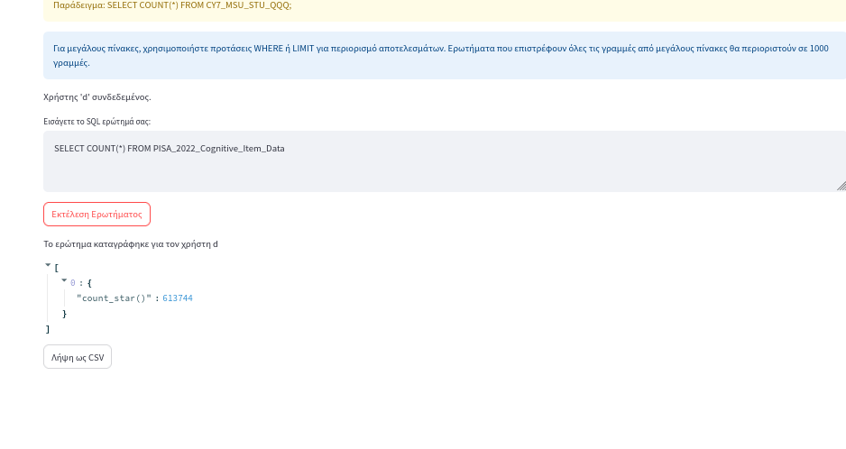

## 3.9 Πίνακας Διαχείρισης Διαχειριστή

Ο "Πίνακας Διαχείρισης Διαχειριστή" είναι μια ειδική λειτουργία που προορίζεται αποκλειστικά για χρήστες με ρόλο διαχειριστή. Παρέχει εργαλεία για τη διαχείριση χρηστών, την παρακολούθηση στατιστικών και τη διαχείριση της βάσης δεδομένων της εφαρμογής.

### Σημαντικές Σημειώσεις:
*   Αυτή η σελίδα είναι προσβάσιμη μόνο από χρήστες με ρόλο **"διαχειριστή"**. Εάν δεν είστε συνδεδεμένοι ως διαχειριστής, η πρόσβαση θα απορριφθεί.

Η λειτουργία χωρίζεται σε τέσσερις κύριες καρτέλες: "Όλοι οι Χρήστες", "Εκκρεμείς Εγκρίσεις", "Στατιστικά" και "Database Maintenance".

### Καρτέλα "Όλοι οι Χρήστες"

Αυτή η καρτέλα επιτρέπει την πλήρη διαχείριση όλων των εγγεγραμμένων χρηστών:
1.  **Σύνοψη Χρηστών.** Εμφανίζει συνολικά στατιστικά για τους χρήστες (πλήθος συνολικών, ενεργών, εκκρεμών και αποκλεισμένων χρηστών).
    


2.  **Φιλτράρισμα Χρηστών.** Μπορείτε να φιλτράρετε τη λίστα των χρηστών με βάση την κατάσταση ("Ενεργοί", "Εκκρεμείς", "Αποκλεισμένοι") και τον ρόλο ("διαχειριστής", "χρήστης").
    
    

3.  **Λίστα Χρηστών και Διαχείριση.** Εμφανίζεται μια αναλυτική λίστα των χρηστών. Για κάθε χρήστη, μπορείτε να δείτε λεπτομέρειες και να εκτελέσετε ενέργειες:
    *   **Έγκριση/Αποκλεισμός/Ξεμπλοκάρισμα**: Αλλαγή της κατάστασης του λογαριασμού.
    *   **Διαγραφή**: Διαγραφή του λογαριασμού χρήστη.
    *   **Αλλαγή Ρόλου**: Αλλαγή του ρόλου του χρήστη μεταξύ "διαχειριστή" και "χρήστη".
    
    

### Καρτέλα "Εκκρεμείς Εγκρίσεις"

Αυτή η καρτέλα εστιάζει στους χρήστες που έχουν κάνει εγγραφή αλλά αναμένουν έγκριση:
1.  **Λίστα Εκκρεμών Χρηστών.** Εμφανίζει τους χρήστες που έχουν κατάσταση "εκκρεμείς".
2.  **Έγκριση/Απόρριψη.** Για κάθε εκκρεμή χρήστη, μπορείτε να τον **"Έγκριση"** (ενεργοποιώντας τον λογαριασμό του) ή να τον **"Απόρριψη"** (διαγράφοντας την εγγραφή του).
    


### Καρτέλα "Στατιστικά"

Η καρτέλα "Στατιστικά" παρέχει γραφήματα και πίνακες με συνολικές πληροφορίες για τη βάση χρηστών:
1.  **Κατανομή Καταστάσεων.** Ραβδόγραμμα που δείχνει την κατανομή των χρηστών ανά κατάσταση (Ενεργοί, Εκκρεμείς, Αποκλεισμένοι).
2.  **Κατανομή Ρόλων.** Ραβδόγραμμα που δείχνει την κατανομή των χρηστών ανά ρόλο (διαχειριστής, χρήστης).
3.  **Επισκόπηση Όλων των Χρηστών.** Πίνακας με αναλυτικά στοιχεία όλων των χρηστών.
    


### Καρτέλα "Database Maintenance" (Συντήρηση Βάσης Δεδομένων)

Αυτή η καρτέλα είναι κρίσιμη για τη διαχείριση της βάσης δεδομένων και απαιτεί προσοχή:
1.  **Περιγραφή Λειτουργίας Συντήρησης.** Εξηγεί τι περιλαμβάνει η "Πλήρης Λειτουργία Συντήρησης" (ανέβασμα αρχείων SAV, δημιουργία/επαναφορά αντιγράφων, συμπίεση βάσης δεδομένων). Επίσης, περιγράφει τι συμβαίνει στο σύστημα όταν βρίσκεται σε αυτή τη λειτουργία.
2.  **Εναλλαγή σε Λειτουργία Συντήρησης.** Παρέχει ένα κουμπί "Εναλλαγή σε Λειτουργία Συντήρησης". Με την ενεργοποίηση του, το σύστημα θα μεταβεί σε ένα ειδικό περιβάλλον συντήρησης. **Σημαντικό:** Κατά τη διάρκεια αυτής της εναλλαγής, η πρόσβαση των χρηστών στο κύριο σύστημα διακόπτεται.
    


3.  **Οδηγίες Εισόδου/Εξόδου.** Παρέχονται αναλυτικές οδηγίες για το πώς να εισέλθετε και να εξέλθετε από τη λειτουργία συντήρησης.
4.  **Τι Συμβαίνει κατά τη Διάρκεια της Εναλλαγής.** Λεπτομερής περιγραφή των διεργασιών που εκτελούνται κατά την εναλλαγή μεταξύ κανονικής λειτουργίας και λειτουργίας συντήρησης.
    
    