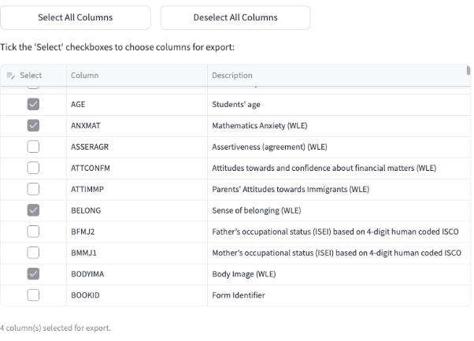
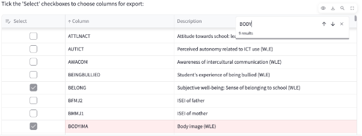

# 4. Συμπληρωματικές πληροφορίες

## 4.1 Περιγραφή γραφικών στοιχείων ελέγχου εφαρμογής

Η εφαρμογή χρησιμοποιεί διάφορα γραφικά στοιχεία ελέγχου (control objects) για την αλληλεπίδραση του χρήστη, τα οποία διευκολύνουν την επιλογή δεδομένων και φίλτρων. Ακολουθεί μια περιγραφή των πιο συχνά χρησιμοποιούμενων:

1.  **Πτυσσόμενη λίστα μονής επιλογής (Dropdown Single Select):** Αυτό το στοιχείο επιτρέπει στον χρήστη να επιλέξει **μία μόνο τιμή** από μια προκαθορισμένη λίστα. Πριν την επιλογή, εμφανίζεται μια προεπιλεγμένη ή κενή τιμή. Μετά την επιλογή, εμφανίζεται η επιλεγμένη τιμή.
    *   **Πριν την επιλογή:** 
    
    
    
    *   **Μετά την επιλογή:** 
    
    

2.  **Πτυσσόμενη λίστα πολλαπλών επιλογών (Dropdown Multi Select):** Αυτό το στοιχείο επιτρέπει στον χρήστη να επιλέξει **μία ή περισσότερες τιμές** από μια προκαθορισμένη λίστα. Οι επιλεγμένες τιμές εμφανίζονται ως "ετικέτες" μέσα στο πεδίο. Ο χρήστης μπορεί να αφαιρέσει μια επιλογή κάνοντας κλικ στο 'x' δίπλα στην ετικέτα της ή να αφαιρέσει όλες τις επιλογές κάνοντας κλικ στο 'x' που βρίσκεται στη δεξιά πλευρά του πεδίου.
    *   **Πριν την επιλογή:** 
    
    
    
    *   **Μετά τις επιλογές:** 
    
    

3.  **Πλέγμα παρουσίασης εγγραφών πίνακα της Βάσης Δεδομένων (Data Table/Editor):** Πρόκειται για έναν διαδραστικό πίνακα που εμφανίζει εγγραφές από τη βάση δεδομένων. Ο χρήστης μπορεί να αλληλεπιδράσει με αυτόν τον πίνακα ως εξής:
    *   **Επιλογή πεδίων:** Μπορεί να επιλέξει συγκεκριμένα πεδία (ή γραμμές δεδομένων) χρησιμοποιώντας τα πλαίσια ελέγχου (checkboxes) που βρίσκονται στην αριστερή στήλη του πίνακα.
    
    
    
    *   **Ταξινόμηση:** Κάνοντας κλικ στον τίτλο οποιασδήποτε στήλης, ο χρήστης μπορεί να ταξινομήσει τις εγγραφές του πίνακα με αύξουσα ή φθίνουσα σειρά, ανάλογα με τα περιεχόμενα της συγκεκριμένης στήλης.
    *   **Φιλτράρισμα:** Υπάρχει η δυνατότητα φιλτραρίσματος των εγγραφών του πίνακα, εισάγοντας κείμενο στο πεδίο αναζήτησης που βρίσκεται συνήθως πάνω από τον τίτλο κάθε στήλης. Αυτό επιτρέπει την εμφάνιση μόνο των εγγραφών που περιέχουν το εισαχθέν κείμενο.
    
    
